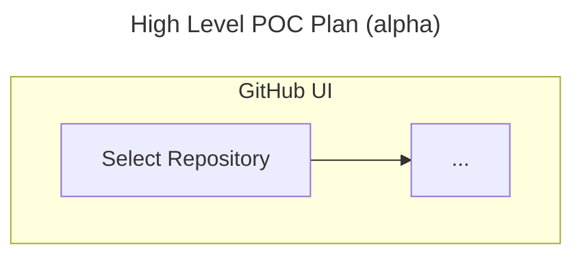

# :construction_worker: This is a WIP

### Steps to find UI settings starting from your default [github.com](https://github.com/) landing page:
<table width="100%">
    <thead>
        <tr>
            <th>Entity</th>
            <th>Steps</th>
            <th>Link</th>
        </tr>
    </thead>
    <tbody>
        <tr>
            <td>Enterprise</td>
            <td>
                1. Select your profile image from the header. 
                2. Select _Enterprises_. 
                3. Select the appropriate enterprise. 
                4. Select _Policies_. 
                5. Select _Repository_ -> _Repository_.
            </td>
            <td>Enterprise</td>
        </tr>
        <tr>
            <td>Organization</td>
            <td>
                1. Select your profile image from the header. 
                2. Select _Organizations_. 
                3. Select the appropriate organization. 
                4. Select _Settings_. 
                5. Select _Repository_ -> _Rulesets_ -> _New ruleset_.
            </td>
            <td>Organization</td>
        </tr>
        <tr>
            <td>Repository</td>
            <td>
                1. Select your profile image from the header. 
                2. Select _Repositories_ OR Select the appropriate organization -> _Repositories_. 
                3. Select the appropriate repository. 
                4. Select _Settings_. 
                5. Select _Rules_ -> _Rulesets_ -> _New ruleset_.
            </td>
            <td>Repository</td>
        </tr>
    </tbody>
</table>

