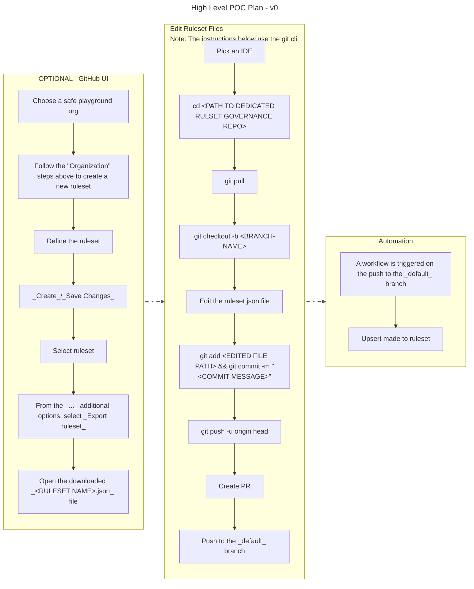

# :construction_worker: This is a WIP

### Steps to find UI settings from [github.com](https://github.com/):
<table width="100%">
    <thead>
        <tr>
            <th>Entity</th>
            <th>Steps</th>
            <th>Link</th>
        </tr>
    </thead>
    <tbody>
        <tr>
            <td>Enterprise</td>
            <td>
                1. Select your profile image from the header. 
                2. Select <i>Enterprises</i>. 
                3. Select the appropriate enterprise. 
                4. Select <i>Policies</i>. 
                5. Select <i>Repository</i> -> <i>Repository</i>.
            </td>
            <td>https://github.com/enterprises/<var>&lt;ENTERPRISE SLUG&gt;</var></td>
        </tr>
        <tr>
            <td>Organization</td>
            <td>
                1. Select your profile image from the header. 
                2. Select <i>Organizations</i>. 
                3. Select the appropriate organization. 
                4. Select <i>Settings</i>. 
                5. Select <i>Repository</i> -> <i>Rulesets</i> -> <i>New ruleset</i> || <i>Select &lt;RULESET NAME&gt;</i>.
            </td>
            <td>https://github.com/<var>&lt;ORGANIZATION SLUG&gt;</var></td>
        </tr>
        <tr>
            <td>Repository</td>
            <td>
                1. Select your profile image from the header. 
                2. Select <i>Repositories</i> OR Select the appropriate organization -> <i>Repositories</i>. 
                3. Select the appropriate repository. 
                4. Select <i>Settings</i>. 
                5. Select <i>Rules</i> -> <i>Rulesets</i> -> <i>New ruleset</i> || <i>Select &lt;RULESET NAME&gt;</i>.
            </td>
            <td>https://github.com/<var>&lt;ORGANIZATION SLUG&gt;</var>/<var>&lt;REPO NAME&gt;</var></td>
        </tr>
    </tbody>
</table>

